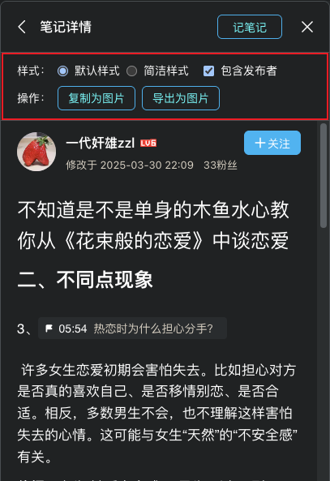

# B 站视频笔记导出工具



一个用于导出 B 站视频笔记的 Tampermonkey 脚本 🔧

## ✨ 功能特性

- 支持将 B 站视频笔记导出为图片
- 支持将笔记复制为图片到剪贴板
- 提供默认样式和简洁样式两种导出风格
- 可选择是否包含发布者信息
- 自动保存用户的样式偏好设置

## 📦 安装

1. 首先安装 [Tampermonkey](https://www.tampermonkey.net/) 浏览器扩展
2. 点击 [安装脚本](https://github.com/showlotus/tampermonkey-scripts/blob/main/packages/bilibili-video-note-export/dist/bilibili-video-note-export.user.js)

## 🚀 使用方法

1. 打开任意 B 站视频页面
2. 点击视频下方的笔记按钮
3. 在笔记详情页面中，你可以：
   - 选择导出样式（默认/简洁）
   - 选择是否包含发布者信息
   - 点击"复制为图片"将笔记复制到剪贴板
   - 点击"导出为图片"将笔记保存为本地图片

## 🔧 开发

```bash
# 安装依赖
pnpm install

# 开发模式
pnpm dev

# 构建
pnpm build
```

## 🤝 许可证

MIT License
